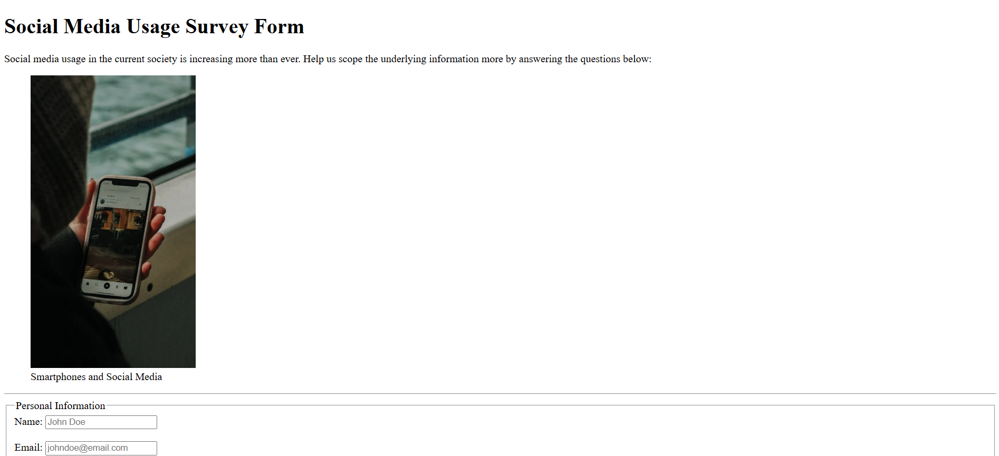

# 💻 Survey Form

## ℹ️ A Simple Social Media Usage Survey Form

A semantic and accessible **HTML5-only survey form** designed to collect user data about social media usage in modern society. Created as part of the [freeCodeCamp.org](https://www.freecodecamp.org/learn/full-stack-developer/) HTML5 free course.

---

## 🔍 Overview

This survey form explores how people use social media, how long they spend on platforms daily, and their reasons for using it. It includes various input types such as text, number, email, select dropdowns, radio buttons, checkboxes, and a textarea.

---

## ✨ Features

- Semantic HTML5 document structure using `<header>`, `<main>`, `<form>`, `<fieldset>`, and `<footer>`
- Accessible form labels and ARIA-friendly markup
- Valid input types for name, email, age, roles, time spent, and platforms used
- Base-level responsiveness via `<meta viewport>`
- Inline figure and caption with descriptive alt text
- Thoughtful placeholder content to guide the user

---

## 🧠 What I Learned

- How to create a structured HTML form using fieldsets and legends
- Best practices for accessibility using `<label for="">` and form input relationships
- The role of semantic HTML in non-CSS, non-JavaScript environments
- Reinforced usage of meta tags for authorship, description, and Open Graph sharing

---

## 🛠️ Tech Used

- HTML5
- Git
- GitHub
- Netlify

---

## 🚀 How to Run

1. Clone the repository
2. Open `index.html` in your browser

---

## 🌐 Live Demo

Or you can check out the 👉 [live website here](https://survey-form-fcc-jiro.netlify.app/)

---

## 🧑‍💻 Author

Created by **Elmar Chavez**

🗓️ Month/Year: **April 2025**

📚 Journey: **1st** month of learning _frontend web development_.
